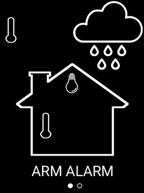
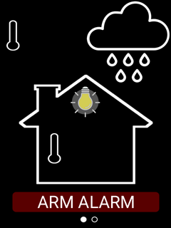
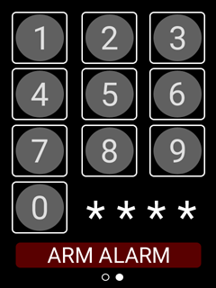

# customised-hasp
Nextion display and ESP8266 firmware-based implementation of the HA Switch Plate. Displays useful information as you're leaving the house including temperature inside, temperature outside, forecast rainfall and whether any monitored lights are left on in the house. It also includes an alarm interface for quickly enabling or disabling the HA-based alarm system.

 

This repository is for my custom implementation using the budget touchscreen Nextion 240x320 display by iTead. The Nextion Studio Editor makes it easy to create your own graphical interface. This implementation uses a graphic display (created in Photoshop) and picture cropping to create the alternative display options.

 

The display integrates into Home Assistant via MQTT. The Alarm Control panel is assumed to be the MQTT-Manual variant, therefore alarm code verification is done in the firmware.

 

I am not a professional designer or coder and this code is designed to be "good enough" for its intended purpose. It borrows heavily from other open-source projects including HASP and the Bruh Automation multi-sensor.

The interface:

Home screen - on the home screen temperatures in degrees centigrade appear next to the thermometers and expected rainfall in mm inside the rain cloud.

Alarm screen.

